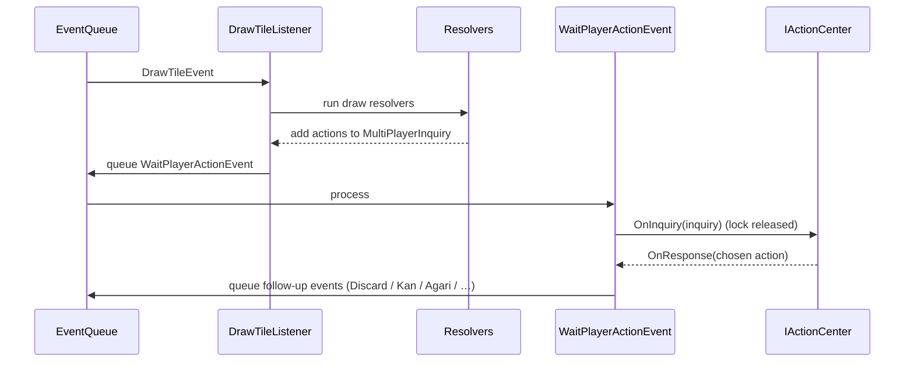

# Actions & Inquiries

When the engine needs a decision, it builds an **inquiry** describing the legal
choices and asks the players (through your `IActionCenter`). This is the only way
the outside world drives the engine.

## `IPlayerAction` and the action types

`Actions/PlayerAction.cs` defines `IPlayerAction` and the base `PlayerAction<T>`.
Each action has a `priority` (higher preempts lower) and an `OnResponse(string)`
that parses/validates the player's choice. Priorities:

```text
Ron / Riichi / Discard / Ryuukyoku = 10000   (top)
Kan = 4000   Pon = 3000   Chii = 2000   Skip = 1000
```

The concrete actions:

| Action | Meaning |
| --- | --- |
| `PlayTileAction` | Discard a tile (carries `candidates`, see below). |
| `RiichiAction` | Declare riichi (a `PlayTileAction` restricted to legal riichi discards). |
| `ChiiAction` / `PonAction` / `KanAction` | Call a meld. |
| `NukiDoraAction` | Pull a North (拔北). |
| `AgariAction` → `RonAction` / `TsumoAction` | Declare a win. |
| `RyuukyokuAction` | Declare an abortive draw (e.g. nine terminals). |
| `SkipAction` | Decline (the default, lowest priority). |
| `NextRoundAction` | Acknowledge the next round. |

### Discard candidates & tenpai info

`PlayTileAction` computes `candidates: List<DiscardCandidate>`. Each
`DiscardCandidate` pairs a discardable tile with the `TenpaiInfo` list it would
leave — i.e. **what you'd be waiting on, and how much each wait is worth**:

```csharp
class TenpaiInfo   { Tile winningTile; int han, yaku, fu, yakuman; long points; }
class DiscardCandidate { GameTile tile; List<TenpaiInfo> tenpaiInfos; }
```

The value shown is a **guaranteed minimum**: it's scored as a ron with only
`Regular | Bonus` yaku (excluding luck yaku like ippatsu/haitei/rinshan and
tsumo-only value), so a preview never over-promises. This is what powers the
client's tenpai indicator.

## Single- and multi-player inquiries

- `SinglePlayerInquiry` (`Actions/SinglePlayerInquiry.cs`) — the choices for
  **one** player. It always starts with a default `SkipAction`; `DisableSkip()`
  removes it (used for the active player's own mandatory discard). `maxPriority`
  and `curPriority` track contention; `OnResponse(index, response)` records the
  choice.
- `MultiPlayerInquiry` (`Actions/MultiPlayerInquiry.cs`) — aggregates the
  per-player inquiries and resolves priority contention. `Add(action)` routes an
  action to the right player. It completes (`Finish()`) when every player has
  either responded or can no longer beat the current top priority, then keeps
  **only the highest-priority responses** (possibly several — e.g. multi-ron) and
  runs their handlers.

:::warning[Await via the event, not the task]
`MultiPlayerInquiry.WaitForFinish` should be awaited through
`WaitPlayerActionEvent`, which releases the engine's processing lock while
waiting. Awaiting it directly would hold the lock and stall the game.
:::

## Resolvers — deciding what's legal

A **resolver** (`Actions/Resolver/`) decides *which* actions to offer to *which*
players and adds them to the shared inquiry. The base `ResolverBase` has two
abstract methods:

- `ResolvePlayers(player, incoming)` — who could act.
- `ResolveAction(player, incoming, output)` — test legality for one player and,
  if legal, `output.Add(...)` the action.

Concrete resolvers include `PlayTileResolver`, `RonResolver` (checks furiten and a
valid, min-han-satisfying hand for each opponent), the chankan family
(`ChankanResolver`, `ChanAnkanResolver`, `NukiChankanResolver`), `RiichiResolver`,
`TenhouResolver`, `NukiDoraResolver`, and the meld resolvers
(`ChiiResolver` / `PonResolver` / `KanResolver`). They're all registered as DI
singletons by `RiichiSetup`.

## `IActionCenter` — your bridge

The engine talks to the outside world through `config.actionCenter`. Its two key
callbacks:

- `OnEvent(seat, ev)` — an event to deliver to a seat (already privacy-filtered
  for that seat by the serializer).
- `OnInquiry(inquiry)` — an inquiry to present; you collect responses and call
  `inquiry.OnResponse(...)`.

A minimal in-process implementation (auto-answering the default choice) is enough
for simulation; the [server](../server/overview.md) implements it to send
inquiries over WebSockets, and the [scenario tests](../testing/scenario-test.md)
implement it to script responses. AI bots implement the same interface — see
[AI agents](../server/ai-agents.md).

## Putting it together (one turn)


