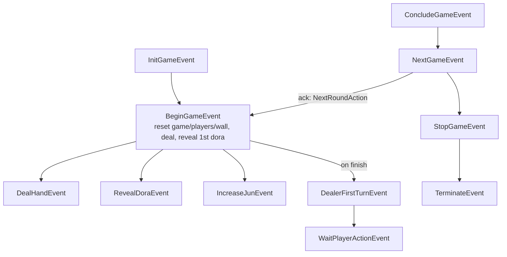
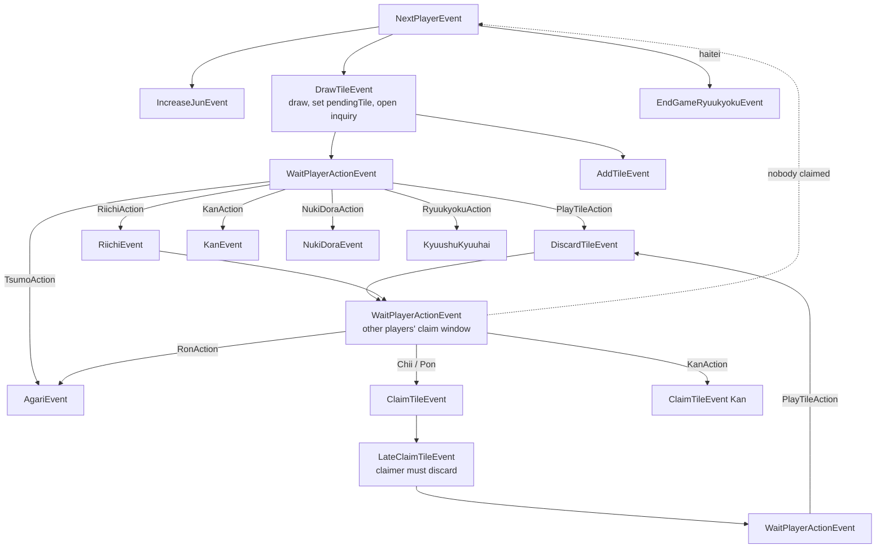
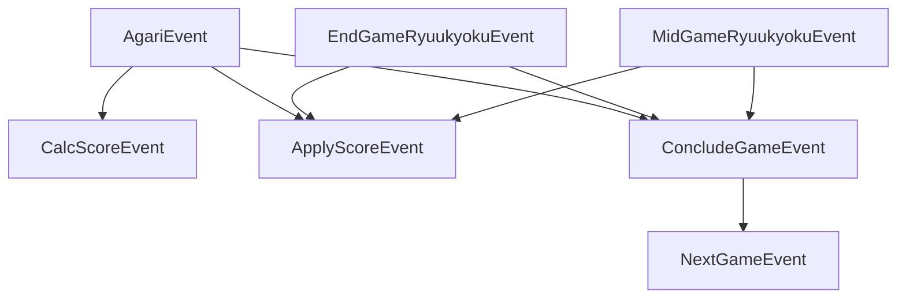

# The Event System

Everything the engine does is an **event**. A FIFO queue pumps events; each event
runs its listeners in priority order; listeners mutate state and queue more
events. Player decisions are just a special event that pauses the queue until an
answer arrives.

## Building blocks

### `EventBase`

`Events/EventBase.cs`. Every event derives from `EventBase` (or `PlayerEvent` /
`PrivatePlayerEvent`, which add a `playerId`). An event carries:

- `name`, `game`, and `Q` (the queue it lives in).
- `phase` — starts at `Maximum` and only ever descends as listeners run.
- Parent/child links (`Cancel()` cascades to children; `GetInParent<T>()` walks
  up), plus `OnFinish` and an `extraData` bag.

### `EventPriority` bands

Listeners subscribe within priority **bands**, run high → low for a single event:

```text
Prepare (4e6)  >  Execute (3e6)  >  Broadcast (2e6)  >  After (1e6)
```

Ordering *between different queued events* is strictly FIFO; priority only orders
the listeners of one event. `EventListener<T>` offers band-relative helpers
(`EarlyExec`, `LateExec`, `AfterBroadcast`, …) and scoping (`ScopeTo`, `CancelOn`)
for temporary, self-removing subscriptions.

### `EventBus`

`Events/EventBus.cs`. `Subscribe<T>(handler, priority, times)` registers a
listener for event type `T` **and all its subclasses**. `Process(ev, shouldLock)`
gathers matching listeners, sorts by priority descending, and runs each whose
priority `<= ev.phase`, lowering `ev.phase` after each. A held `eventProcessingLock`
(a semaphore) guards state mutation; it is **released while waiting for player
input** so the game state is frozen but not deadlocked.

### `EventQueue`

`Events/EventQueue.cs`. A FIFO `Queue<EventBase>`. `ProcessQueue(token)` loops:
dequeue → `bus.Process`. A `TerminateEvent` breaks the loop. Listeners enqueue
follow-up work with `ev.Q.Queue(...)` (or `QueueIfNotExist<T>` to dedupe).

### Serialization attributes

Events are serialized per-recipient using attributes (`Communication/`):

- `[RabiMessage]` — the type is serializable.
- `[RabiBroadcast]` — this member is public (sent to everyone).
- `[RabiPrivate]` — owner-only, on a member (dropped for non-owners) or a whole
  class (written as `null` to non-owners).
- `[RabiIgnore]` — never serialized (e.g. `WaitPlayerActionEvent`).

This is how the same event reveals your own tiles to you but hides them from
opponents — and how god-view [replays](../server/replays.md) bypass the filtering
via `Game.onGodViewEvent`.

## The in-game event flow

The following graphs are the developer map of which event triggers which, and
which player **action** gates each transition. (Source: the engine's
`dev/event-flow.md`, generated from `Events/InGame/**`.)

Legend:

- Solid arrow `A --> B`: A's listener directly queues B.
- Labelled arrow `A --|Action|--> B`: B is produced only if a player chooses
  `Action`.
- Dashed arrow `A -.->|when| B`: B is armed now but queued later.

### Game / round lifecycle



`NextRoundAction` is only an acknowledgment; `BeginGameEvent` is queued once all
acks/timeout resolve. `NextGameEvent` queues `StopGameEvent` instead when an
end-of-match condition holds.

### The turn cycle (draw → act → discard → claim)



The drawing player's `SkipAction` is disabled — they must act. After a discard
with no claim, the turn advances; after a chii/pon the claimer discards via
`LateClaimTileEvent`.

### Win / draw / scoring



Abortive draws (each clears the queue then queues its ryuukyoku): `SuufonRenda`
(four same winds first jun), `SuuchaRiichi` (four riichi), `Sanchahou` (triple
ron), `SuukanSanra` (four kans by different players), `KyuushuKyuuhai` (nine
terminals/honors on the first draw).

## How a player decision works

Turn-producing events (`DrawTileEvent`, `DiscardTileEvent`, `NukiDoraEvent`, …)
run **resolvers** that populate a `MultiPlayerInquiry` with the legal actions for
each player, then queue a `WaitPlayerActionEvent`. Its listener:

1. sends the inquiry to clients via the `IActionCenter`,
2. starts a timeout,
3. **releases** the processing lock and awaits the response,
4. re-acquires the lock, then queues the follow-up events produced by the chosen
   action(s).

Only the highest-priority chosen action(s) fire (Ron outranks Pon, etc.). See
[Actions & inquiries](./actions-and-inquiries.md) for the full picture.

## Adding behavior

Every listener is a small static class with a `Register(EventBus)` that calls
`eventBus.Subscribe<TEvent>(Handler, EventPriority.X)`. They're all wired in
`BaseSetup.RegisterEvents`. To change or extend behavior, add a listener (or a new
event + listener) and register it from a custom [setup](./configuration.md#the-pluggable-ruleset).
