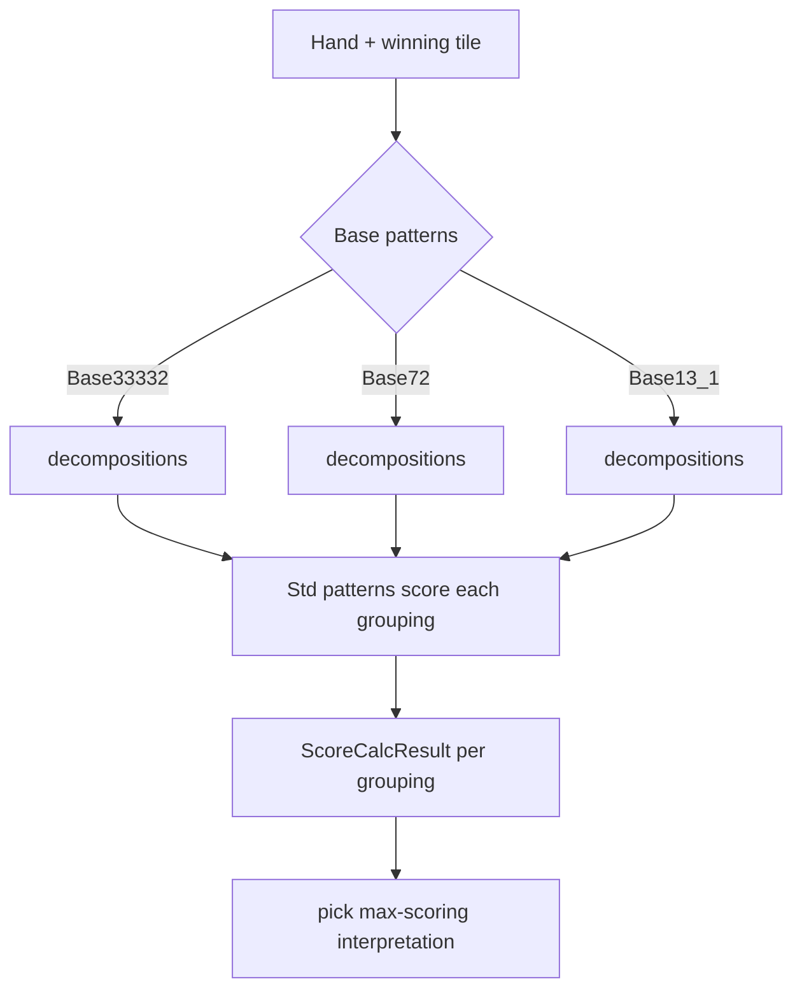

# Patterns & Scoring

Scoring happens in two layers:

1. **Base patterns** decompose 13/14 tiles into melds and compute shanten.
2. **Standard patterns** (yaku, fu, bonus) score a given decomposition into
   han/fu.

The `PatternResolver` ties them together and picks the highest-scoring
interpretation.

## Base patterns — hand shape & shanten

A `BasePattern` (`Patterns/BasePattern.cs`) answers two questions about a hand:

- `Resolve(hand, incoming, out decompositions)` — is this a winning shape, and in
  what ways can the tiles be grouped? Each decomposition is a `List<MenLike>`.
- `Shanten(hand, incoming, out tiles, maxShanten)` — how many tiles away from
  tenpai (−1 = complete). With 13 tiles, `tiles` = useful draws; with 14 tiles,
  `tiles` = the discards that keep the best shanten.

The name encodes the target **meld-size shape**:

| Base pattern | Shape | Hand type |
| --- | --- | --- |
| `Base33332` | `3+3+3+3+2` | Standard: four melds + a pair. |
| `Base72` | `7×2` | Seven pairs (chiitoitsu). |
| `Base13_1` | `13+1` | Thirteen orphans (kokushi). |

`Base33332` is the heavy one: `Resolve` runs a DFS over tile buckets peeling off
pairs/triplets/sequences and enumerates alternative groupings (the winning tile
can belong to different melds, which changes fu); `Shanten` is a dynamic program.

<Tiles notation="123s123s456m22m+23s+4s" caption="A standard (33332) hand completing on 4s" />

## Standard patterns — the yaku

Every yaku, fu calculator, and bonus is a `StdPattern` (`Patterns/StdPattern.cs`).
The one method they all implement:

```csharp
abstract bool Resolve(List<MenLike> groups, Hand hand, GameTile incoming, ScoreStorage scores);
```

Given one decomposition, a yaku checks whether it applies and, if so, pushes one
or more `Scoring` entries and returns `true`. A `Scoring` is
`(ScoringType Type, int Val, StdPattern Source)`.

Yaku declare their relationships fluently:

- `BaseOn(...)` — which base shapes can trigger this yaku.
- `After(...)` — patterns to compute *before* this one.
- `DependOn(...)` — require certain other yaku to have succeeded (also implies
  `After`).

**Examples:**

- **Iipeikou** (`Patterns/1Han/Iipeikou.cs`) — `BaseOn(Base33332)`, requires
  `hand.menzen`, finds two identical sequences, adds 1 han.

  <Tiles notation="11222333s22456m+4s" caption="Iipeikou (two identical 123s sequences)" />

- **Pinfu** (`Patterns/1Han/Pinfu.cs`) — depends on the fu pattern; on success it
  *removes* the normal fu and substitutes the fixed pinfu fu, then adds 1 han.
- **Ryanpeikou** (`Patterns/3Han/Ryanpeikou.cs`) — `DependOn(iipeikou)`; on
  success removes the iipeikou it supersedes and scores 3 han.
- **Daisangen** (`Patterns/Yakuman/Daisangen.cs`) — a yakuman that also overrides
  `OnScoreTransfer` to apply pao (責任払い).

Patterns carry a `PatternMask` (`Regular`, `Bonus`, `Luck`) so callers can select
which to evaluate — e.g. tenpai previews exclude `Luck`.

### Bonus (non-yaku) patterns

`Patterns/NoYaku/` holds `Dora`, `Uradora`, `Akadora`, and `NukiDora`. They emit
`ScoringType.BonusHan` so they add han but don't satisfy the "must have a yaku"
rule.

### Fu

`Patterns/Fu/` has one fu calculator per base shape: `Fu33332` (20 base + meld /
pair / wait / agari fu, rounded up), `Fu72` and `Fu13_1` (fixed-fu shapes).

## Scoring types & results

`ScoringType` (from the proto) is `Han`, `BonusHan`, `Fu`, `Yakuman`.

- `Scoring` — one line item.
- `ScoreStorage` (`Patterns/ScoreStorage.cs`) — the collected `Scoring` items plus
  a computed `ScoreCalcResult`. `Calc(ScoringOption)` folds items into han / yaku
  / fu / yakuman. It supports freeze/rollback so speculative resolution can be
  undone, and `Remove(...)` to strip superseded yaku (used by pinfu/ryanpeikou).
- `ScoreCalcResult` (`Patterns/ScoreCalcResult.cs`) — the final tally with
  `han`, `yaku` (han that counts toward the min-han rule), `fu`, `yakuman`.
  `BaseScore` applies limit rules (mangan → haneman → baiman → sanbaiman,
  kiriage-mangan, aotenjou when yakuman scoring is off), and `IsValid(minHan)`
  enforces the yaku/han requirement.

## `PatternResolver`

`Patterns/PatternResolver.cs` is resolved via `game.Get<PatternResolver>()`:

- `ResolveMaxScore(hand, incoming, patternMask)` — for each base decomposition,
  run the applicable std patterns, compute a `ScoreStorage`, and return the
  **highest-scoring** one. This is what a win uses.
- `ResolveShanten(hand, incoming, out tiles, maxShanten)` — the minimum shanten
  across base patterns, plus the union of useful/discard tiles at that minimum.
  This powers tenpai checks, discard candidates, and riichi legality.



## Adding a yaku

1. Implement a `StdPattern` subclass with a `Resolve` that pushes the right
   `Scoring` entries, declaring `BaseOn` / `After` / `DependOn` as needed.
2. Register it in a custom [setup](./configuration.md#the-pluggable-ruleset)
   (`AddStdPattern<YourYaku>()`).
3. Write a [yaku unit test](../testing/yaku-unit-test.md) with `StdTestBuilder`.
