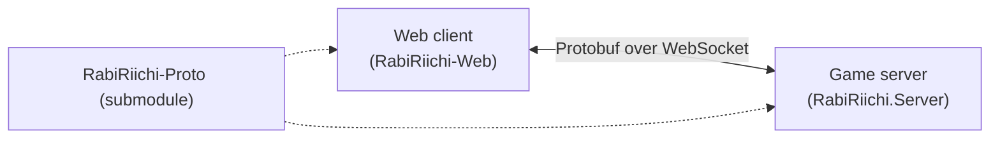

# User Guide

There are two ways to use RabiRiichi:

1. **Just play** — open one of the officially hosted web clients in your browser.
   Nothing to install. Start at [Play online](./play-online.md).
2. **Run it yourself** — build the server (and optionally the web client) from
   source and host your own games.

## Which path is for you?

| I want to… | Go to |
| --- | --- |
| Play right now in my browser | [Play online](./play-online.md) |
| Build everything from a clean machine | [Install from scratch](./install-from-scratch.md) |
| Run the game server locally | [Run the server](./run-the-server.md) |
| Run the 3D web client locally | [Host the web client](./host-the-web-client.md) |
| Deploy a public server (systemd) | [Deploy to production](./deploy-to-production.md) |

## The pieces

RabiRiichi is three repositories that work together:

| Repo | What it is |
| --- | --- |
| [`RabiRiichi`](https://github.com/RabiMimi/RabiRiichi) | The C#/.NET rules engine **and** the WebSocket game server. |
| [`RabiRiichi-Web`](https://github.com/RabiMimi/RabiRiichi-Web) | The 3D browser client (Vite + React + three.js). |
| [`RabiRiichi-Proto`](https://github.com/RabiMimi/RabiRiichi-Proto) | The shared Protobuf definitions, used by both as a git submodule. |

The **web client** connects to a **server** over a WebSocket. To play, you only
need a client pointed at a running server — and the official clients already
bundle a server picker, so most people never build anything.

:::tip[Just want to play?]
Skip straight to [Play online](./play-online.md). The rest of this guide is for
running your own server or client.
:::

Developers building on the engine or protocol should read the
[Core Engine](../core/overview.md) and [Server](../server/overview.md) docs
instead.
