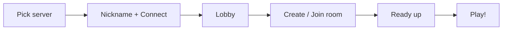

# Play Online

The fastest way to play is the officially hosted 3D web client. It runs entirely
in your browser; there's nothing to download.

## Official web clients

| Environment | Open in browser | Talks to server |
| --- | --- | --- |
| **Production** — 兔兔立直 | https://riichi.rabimimi.com | `wss://riichi-server.rabimimi.com` |
| **Development** — 兔兔开发 | https://riichi-dev.rabimimi.com | `wss://riichi-server-dev.rabimimi.com` |

Use **Production** for normal play. The **Development** instance tracks the latest
in-progress build and may be unstable or reset without notice.

:::note[Modern browser required]
The client is a 3D game (three.js/WebGL). Use an up-to-date Chrome, Edge, Firefox,
or Safari with hardware acceleration enabled.
:::

## Step by step

### 1. Pick a server

On the connect screen, choose a server. The client ships with three presets:

| Preset | Address | Use it for |
| --- | --- | --- |
| **Rabimimi** | `wss://riichi-server.rabimimi.com` | Normal play (production). |
| **Rabimimi Dev ❤️** | `wss://riichi-server-dev.rabimimi.com` | Testing the newest features. |
| **Local (localhost:5150)** | `ws://localhost:5150` | A server you're [running yourself](./run-the-server.md). |

You can also add a **Custom Server Address** (it must start with `ws://` or
`wss://`) and save it for later. Custom servers are stored in your browser.

### 2. Enter a nickname & connect

Type a nickname (1–16 characters) and press **Connect**. The client creates an
anonymous account on that server and stores an access token in your browser, so
you'll be recognized when you return. You land in the **Lobby**.

### 3. Create or join a room

From the Lobby you can:

- **Create Room** — configure the rules (players, rounds, min han, points,
  allowed yaku, tile set, timeouts, optional seed) and open a room. You become
  the room owner and can add AI players to fill seats.
- **Join Room** — enter a room id shared by a friend.
- **View Replay** — watch a saved game by its game id (if the server has replays
  enabled).

### 4. Ready up and play

When everyone in the room is **Ready** and all seats are filled, the game starts
automatically. Bots you added are readied for you.

## Connecting a client to a different server

Any RabiRiichi web client can talk to any RabiRiichi server — the server address
is chosen at connect time, not baked in. So you can:

- open the official client and point it at **your own** server via *Custom Server
  Address* (e.g. `ws://localhost:5150` or `wss://your-domain`), or
- [host your own web client](./host-the-web-client.md) and point it anywhere.

:::warning[Mixed secure/insecure connections]
A client served over **HTTPS** (like the official ones) can only open a **`wss://`
(secure)** WebSocket. Browsers block secure pages from connecting to insecure
`ws://` addresses. To reach a plain `ws://localhost:5150` server, run the web
client locally over `http://` (see [Host the web client](./host-the-web-client.md)),
or put your server behind TLS so it's reachable at `wss://`.
:::

## Troubleshooting

- **"Server version too old / Client version too old"** — the client and server
  handshake on a minimum supported version. Use the matching client for the
  server (the official production client matches the production server), or update
  whichever side you built yourself.
- **Can't connect to `ws://localhost:5150` from the official site** — that's the
  mixed-content block above; run the client locally over HTTP instead.
- **"Server is busy"** — the server's request queue is saturated; try again
  shortly.
