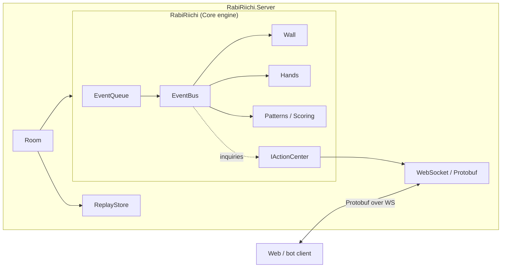

# RabiRiichi

**RabiRiichi (兔兔立直)** is a [riichi mahjong](https://en.wikipedia.org/wiki/Japanese_mahjong)
engine written in C# for .NET, together with an ASP.NET server that hosts it over
WebSockets.

The project is split into two independently useful pieces:

- The **Core engine** (`RabiRiichi.csproj`) — a self-contained, headless rules
  engine. It knows tiles, hands, walls, yaku, scoring, and the full event flow of
  a hand. It has no networking and no UI; you drive it through an event queue and
  a small player-action interface. This is what you embed if you want to run,
  analyze, or bot mahjong.
- The **Server** (`RabiRiichi.Server`) — an ASP.NET Core app that turns the engine
  into a multiplayer service: rooms, seats, reconnection, AI substitution,
  god-view replays, and a Protobuf-over-WebSocket protocol.



## Who this is for

- **Players & self-hosters** — you want to play, run your own server, or host the
  web client. Start with the [User Guide](./guide/overview.md) (or jump straight
  to [Play online](./guide/play-online.md)).
- **Engine integrators** — you want to run games in-process (simulation,
  analysis, a custom front end). Start with the [Core Engine](./core/overview.md).
- **Server / protocol developers** — you want to host games, or write a client
  that speaks the wire protocol. Start with the [Server](./server/overview.md).
- **Contributors** — you're adding a yaku, fixing a rule, or writing tests.
  Read the [Core Engine](./core/overview.md) docs, then the
  [Testing guides](./testing/overview.md).

## A taste of the API

Creating and running a game is a matter of building a `GameConfig`, plugging in
an `IActionCenter` (how players are asked to act), and calling `Start`:

```csharp
var config = new GameConfig {
  playerCount = 4,
  actionCenter = myActionCenter, // decides how inquiries are answered
  seed = 1145141919810ul,        // optional: deterministic shuffles
};
var game = new Game(config);
await game.Start();               // runs the whole match to completion
```

Everything else — dealing, drawing, claims, scoring, dealer rotation — is driven
internally by the [event system](./core/events.md).

## Tile notation in these docs

Throughout the docs, hands are drawn with real tile images generated from
RabiRiichi's compact **tile notation** — the same notation used in the test
suite. For example, `123m456p789s11z` renders as:

<Tiles notation="123m456p789s11z" />

The full grammar (suits, red fives, called melds, concealed kan, winning tile)
is described in [Tile notation](./core/tile-notation.md).

## Project facts

- **Language / runtime:** C#, .NET 9.
- **License:** AGPL v3.
- **Repositories:** the [engine + server](https://github.com/RabiMimi/RabiRiichi)
  and [these docs](https://github.com/RabiMimi/RabiRiichi-Docs).
- **Shared protos:** wire messages live in a `Protos` git submodule shared with
  the web client, compiled at build time.
