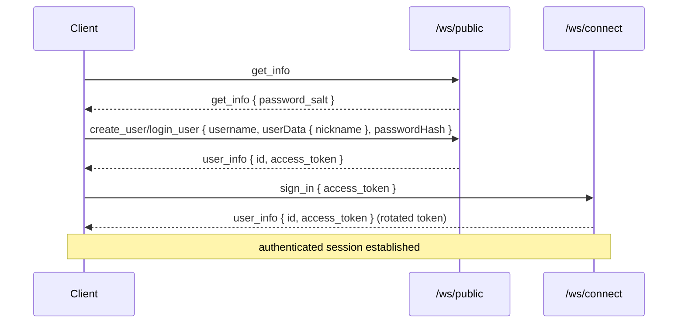

# Authentication

Authentication is intentionally lightweight: a user is created anonymously and
handed a long-lived JWT, which it presents to open an authenticated session.

## Token model

`Auth/TokenService.cs`:

- **Signing key** — HMAC-SHA256 from the `JWT_SECRET` environment variable. (In
  Development a secret is provided via `launchSettings.json`.)
- **Issuer** — `RabiRiichi-vanilla-grpc`; audience validation is disabled.
- **Lifetime** — 7 days (`TOKEN_DURATION_MINUTES`).
- `BuildToken(userId)` issues a token whose single claim (`NameIdentifier`) is the
  user id in hex.
- `IsTokenValid(token, out userId)` validates the token and extracts the id.

`Auth/Extensions.cs` adds `UserList.Fetch(context)` / `TryFetch(...)`, which read
the hex user id from the validated claims and look up the `User`; `Fetch` throws
`Unauthenticated` when absent.

## The public / authenticated boundary

There are two WebSocket entry points (see [Transport](./transport.md)):

- **`/ws/public`** — no token required. Only handles requests that are safe
  anonymously: server info (with password salt), user creation, user login, and replay fetch.
- **`/ws/connect`** — the first message must be a `SignIn` carrying a valid access
  token. After the handshake, the session can issue authenticated requests (create
  / join room, ready up, gameplay, get my info). When a user successfully establishes
  an authenticated WebSocket session, a fresh rotated access token is returned.

Typical bootstrap for a new client:



The gRPC-shaped request handlers enforce the same boundary: `RoomServiceImpl` and
the authenticated `GetMyInfo` are `[Authorize]`, and owner-only operations
(`add_ai`, `remove_room_player`) additionally check that the caller is the room's
first human seat.

## Password Hashing & Security

Passwords are hashed client-side before being transmitted over WebSockets to ensure plain-text credentials never touch the wire or server memory.

The hashing scheme is defined as:
```typescript
passwordHash = sha256(passwordRaw + '@' + passwordSalt)
```

The server-configured `RABIRIICHI_PASSWORD_SALT` is served dynamically via the `GetInfo` API response so that different servers can configuration distinct salts. The server stores the received hash directly in the database.

## Configuration

| Env var | Meaning |
| --- | --- |
| `JWT_SECRET` | HMAC signing key for tokens. **Required in production.** |
| `RABIRIICHI_DB_PATH` | Path to the SQLite database file. Defaults to `rabiriichi.db`. |
| `RABIRIICHI_PASSWORD_SALT` | Salt used to hash user passwords on the client side. Defaults to `RABIRIICHI`. |

:::warning[Set strong secrets in production]
The Development secret in `launchSettings.json` and default password salt are for local use only. Be sure to configure unique, secure values in production.
:::
