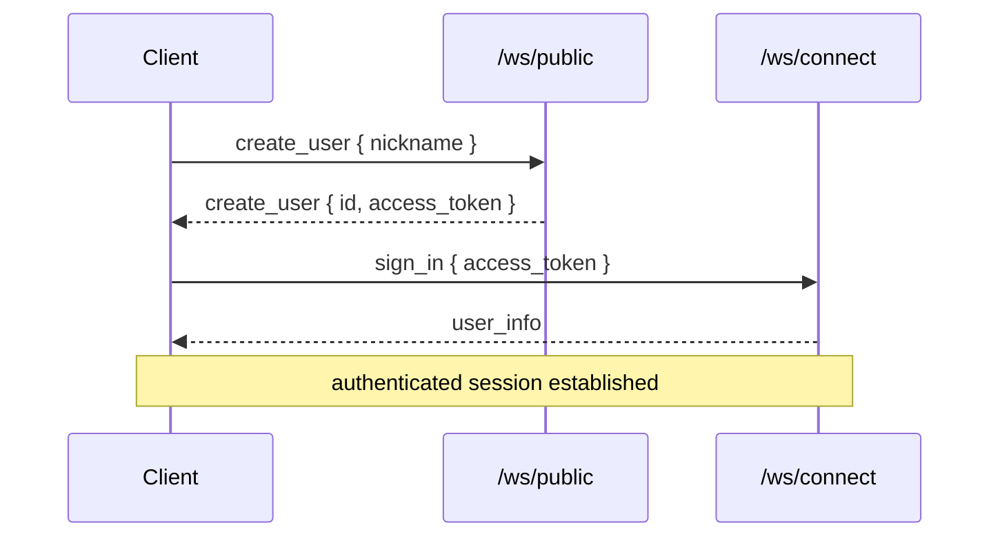

# Authentication

Authentication is intentionally lightweight: a user is created anonymously and
handed a long-lived JWT, which it presents to open an authenticated session.

## Token model

`Auth/TokenService.cs`:

- **Signing key** — HMAC-SHA256 from the `JWT_SECRET` environment variable. (In
  Development a secret is provided via `launchSettings.json`.)
- **Issuer** — `RabiRiichi-vanilla-grpc`; audience validation is disabled.
- **Lifetime** — 7 days (`TOKEN_DURATION_MINUTES`).
- `BuildToken(userId)` issues a token whose single claim (`NameIdentifier`) is the
  user id in hex.
- `IsTokenValid(token, out userId)` validates the token and extracts the id.

`Auth/Extensions.cs` adds `UserList.Fetch(context)` / `TryFetch(...)`, which read
the hex user id from the validated claims and look up the `User`; `Fetch` throws
`Unauthenticated` when absent.

## The public / authenticated boundary

There are two WebSocket entry points (see [Transport](./transport.md)):

- **`/ws/public`** — no token required. Only handles requests that are safe
  anonymously: server info, user creation, and replay fetch.
- **`/ws/connect`** — the first message must be a `SignIn` carrying a valid access
  token. After the handshake, the session can issue authenticated requests (create
  / join room, ready up, gameplay, get my info).

Typical bootstrap for a new client:

The gRPC-shaped request handlers enforce the same boundary: `RoomServiceImpl` and
the authenticated `GetMyInfo` are `[Authorize]`, and owner-only operations
(`add_ai`, `remove_room_player`) additionally check that the caller is the room's
first human seat.

## Configuration

| Env var | Meaning |
| --- | --- |
| `JWT_SECRET` | HMAC signing key for tokens. **Required in production.** |

:::warning[Set a strong JWT_SECRET in production]
The Development secret in `launchSettings.json` is for local use only. Anyone who
knows the signing key can forge tokens.
:::
