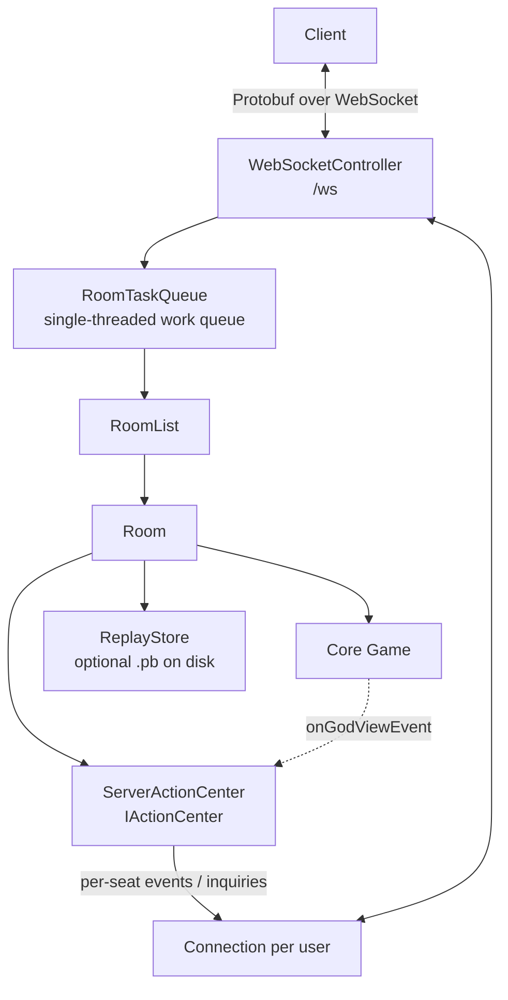

# Server Overview

`RabiRiichi.Server` is an ASP.NET Core (net9.0) app that hosts the
[Core engine](../core/overview.md) as a multiplayer service. It adds everything
the headless engine deliberately leaves out: networking, rooms and seats,
authentication, reconnection, AI substitution, and replays.

## Architecture at a glance

The key ideas:

- **One transport, gRPC-shaped.** All traffic is Protobuf messages over a single
  `/ws` WebSocket. A `WebSocketAdapter` implements the gRPC streaming interfaces,
  so the connection/streaming code is transport-agnostic (a dormant gRPC endpoint
  exists but isn't mapped). See [Transport & protocol](./transport.md).
- **Single-writer concurrency.** Nearly all room/user mutations run through one
  `RoomTaskQueue` (a bounded single-reader channel), giving lock-free-by-
  serialization semantics. Overload surfaces as a `ResourceExhausted` error.
- **Durable connections.** Each `User` owns a `Connection` that survives socket
  drops; a reconnect within a grace window resumes the same session, replays
  missed messages, and re-syncs game state.
- **The engine bridge is `ServerActionCenter`**, the server's `IActionCenter`. It
  serializes each event *per seat* (privacy-filtered), presents inquiries, and —
  for replays — captures a fully-revealed god-view stream.

## The main pieces

| Area | Files | Docs |
| --- | --- | --- |
| Bootstrap / DI | `Startup.cs` | [Running the server](./running.md) |
| Transport | `WebSockets/`, `Connections/` | [Transport & protocol](./transport.md) |
| Rooms & users | `Models/` | [Rooms & users](./rooms-and-users.md) |
| Engine bridge | `Connections/ServerActionCenter.cs` | [Transport](./transport.md), [Replays](./replays.md) |
| Replays | `Services/ReplayStore.cs`, `ReplayCleanupService.cs` | [Replays](./replays.md) |
| Auth | `Auth/` | [Authentication](./auth.md) |
| AI | `Agents/` | [AI agents](./ai-agents.md) |

## Request lifecycle

1. A client opens `/ws/public` (anonymous) or `/ws/connect` (after a token
   handshake).
2. It sends a `ClientMessageDto` containing a `ClientRequest` (with a monotonic
   `id`).
3. The `WebSocketController` dispatches it on the `RoomTaskQueue`
   (`HandlePublic` / `HandlePrivate`).
4. The handler mutates room/user state or reads a replay, and returns a payload
   wrapped as a `ServerMessageDto` with `respond_to = id` so the client can
   correlate.
5. Server-initiated pushes (events, inquiries, room state, chat, heartbeats) flow
   as separate `ServerMsg` / `EventMsg` messages.

Read on: [Transport & protocol](./transport.md).
