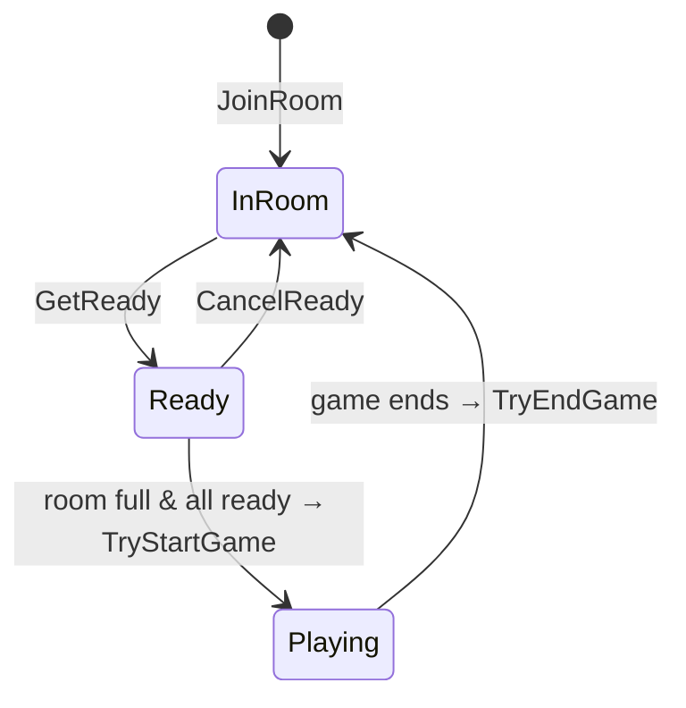

# Rooms & Users

The server's domain model lives in `Models/`. Rooms hold seats; seats are filled
by **player agents** — either humans (`User`) or bots (see [AI agents](./ai-agents.md)).

## Player agents

`Agents/IPlayerAgent.cs` is the shared abstraction for anything that can occupy a
seat: `id`, `nickname`, `status`, `Seat`, plus `GetState()`, `Transit(...)`,
`OnEvent(...)`, and `OnInquiry(...)`. Both `User` and the AI agents implement it,
so rooms treat humans and bots interchangeably.

`Models/User.cs` is the human agent. It owns a durable `Connection`, serializes
each engine event **for its own seat** in `OnEvent`, and in `OnInquiry` sends the
`SinglePlayerInquiryMsg` then races the engine's completion against the client's
response (falling back to the default choice on timeout).

User status is a small FSM (`UserStatus`): `None → InRoom → Ready → Playing` and
back. `Transit(expected, next)` guards every transition.

## Rooms

`Models/Room.cs` — created with an RNG, a `GameConfig`, and an optional
`ReplayStore`. It manages seats (`seats[]` sized to `playerCount`), the running
`Game`, and the players list.

### Seating

`SetupSeat()` copies the joined players into the seat array and Fisher–Yates
shuffles seats using the injected RNG, so seat assignment is randomized (and
reproducible under a fixed server seed in Development).

### Readiness → game start

- `GetReady` / `CancelReady` flip a player between `InRoom` and `Ready`. When the
  room is full and everyone is ready, `TryStartGame` runs.
- **`TryStartGame`** transitions everyone to `Playing`, re-seats, installs a fresh
  `ServerActionCenter` as `config.actionCenter`, assigns
  `game.info.gameId = "{yyyyMMddTHHmmss}-{roomId}"`, **subscribes the god-view
  replay capture before `Start`** (so no early events are missed), then runs
  `game.Start(...)` on a background task. When the game task completes it persists
  the [replay](./replays.md) (if enabled) and calls `TryEndGame`.
- **`TryEndGame`** transitions players back to `InRoom` and **auto-readies AI
  players** so bot-only rooms keep looping.

### Broadcasting & chat

`BroadcastRoomState()` pushes the current `ServerRoomStateMsg` to every human's
connection. `BroadcastChatMessage` re-stamps the sender, **validates sticker
paths** (rejecting `..` / absolute paths — the same class of guard as replay ids),
and forwards text or sticker messages.

### Reconnection & AI substitution

- Each `User` keeps a durable `Connection`. When a socket drops, a
  **5-minute grace timer** (`RECONNECT_GRACE_PERIOD`) starts; if the user
  reconnects in time, the session resumes and `SyncGameTo(user)` re-pushes current
  game state plus any pending inquiry.
- If the grace window expires (or the user explicitly leaves) **mid-game**,
  `RemovePlayer` substitutes a `DefaultAI` into the vacated seat so the game
  continues. If no humans remain, the room's game is cancelled and the room is
  destroyed.
- Pre-game, `RemoveRoomPlayer` can only remove AI players (owner-only); humans
  leave via `RemovePlayer`.

## Lists & the task queue

- `Models/RoomList.cs` — a concurrent map of rooms, assigning a random 4-digit
  room id on `Add`.
- `Models/UserList.cs` — a concurrent map of users with an auto-increment id.
- **`RoomTaskQueue`** (derived from `Utils/TaskQueue.cs`) — a bounded
  single-reader channel through which *all* room/user mutations are serialized.
  This is the server's concurrency backbone; when full it throws
  `ResourceExhausted` ("Server is busy").

Room creation, joining, adding AIs, and readiness are all invoked through this
queue from the `WebSocketController` and the gRPC-shaped request handlers
(`RoomServiceImpl`, `UserServiceImpl`, `InfoServiceImpl`).
